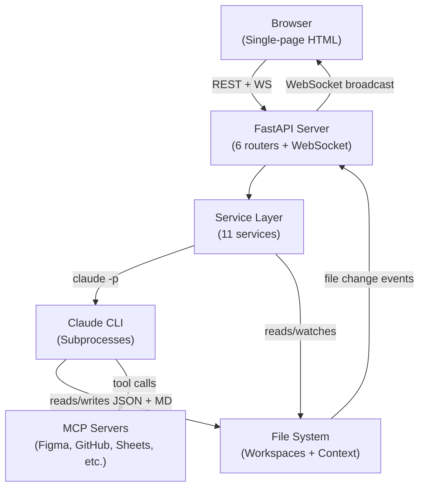
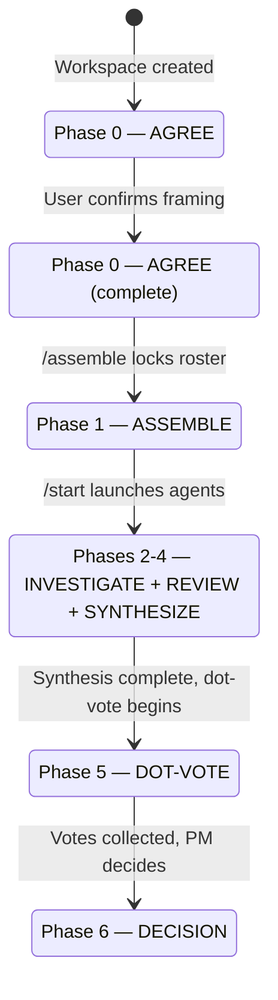
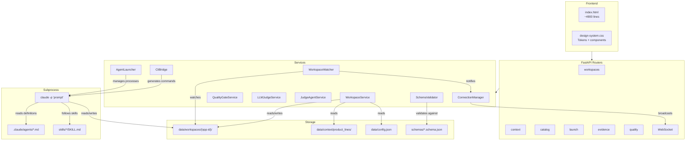
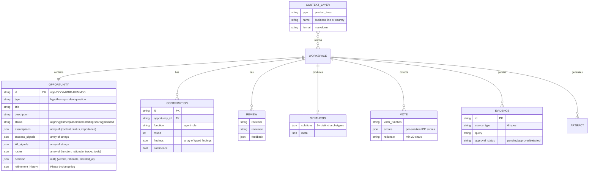
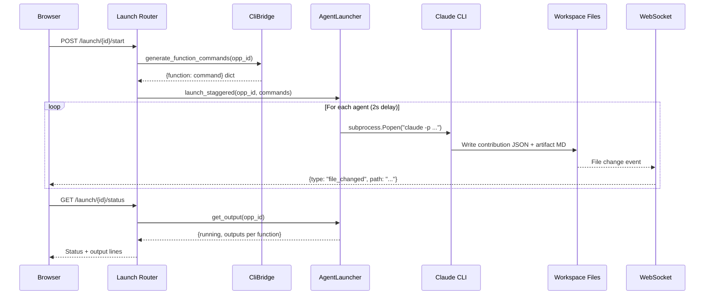
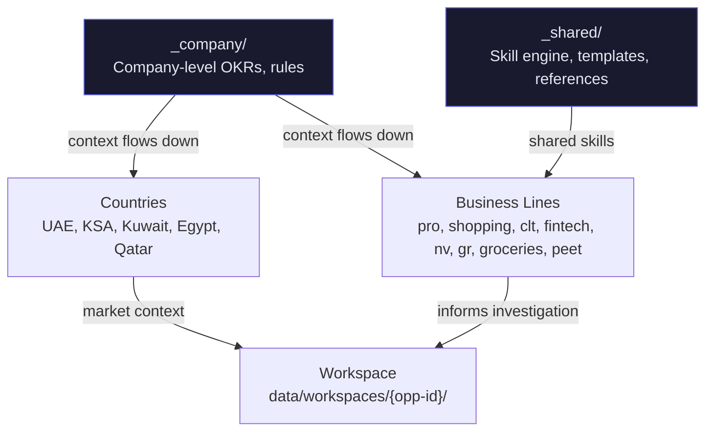

# Orbital — System Design

Orbital is a decision operating system that runs synthetic GV Design Sprints using Claude Code agent teams. Parallel AI agents investigate product opportunities from different functional perspectives, produce a portfolio of distinct solutions, score them via dot-voting, and package everything into a decision brief for leadership.

---

## System Overview



**Key architectural decisions:**
- **File-based storage** — no database. Each workspace is a directory of JSON + markdown files. Simple, inspectable, git-friendly.
- **Claude CLI as subprocess** — agents run as `claude -p "prompt"` processes. The server generates commands (`CliBridge`) and manages processes (`AgentLauncher`).
- **Real-time via filesystem watching** — `WorkspaceWatcher` detects file changes, broadcasts via WebSocket. No polling needed.
- **Single-file frontend** — `server/static/index.html` (~4900 lines). Fast to iterate, but growing. Biggest tech debt item.

---

## Status Lifecycle

Every opportunity moves through 6 states:



| Status | What Happens | Who Acts |
|--------|-------------|----------|
| `aligning` | Refining title, description, assumptions, success/kill signals | User + Claude (multi-turn) |
| `framed` | Framing complete, ready for roster assembly | User triggers /assemble |
| `assembled` | Roster locked, investigation tracks defined, tools assigned | User triggers /start |
| `orbiting` | Parallel agent investigation → peer reviews → synthesis portfolio | Agents (automated) |
| `scoring` | Agents score solutions via dot-vote | Agents (automated) |
| `decided` | PM records verdict: proceed / pivot / kill / need_more_data | User (final) |

---

## Phase Flow

```mermaid
graph LR
    A0["/agree<br/>Frame opportunity"] --> A1["/assemble<br/>Build roster"]
    A1 --> A2["Investigate<br/>Parallel agents"]
    A2 --> A3["Peer Review<br/>Cross-review"]
    A3 --> A4["Synthesize<br/>Solution portfolio"]
    A4 --> A5["Dot-Vote<br/>Score solutions"]
    A5 --> A6["Decision Brief<br/>Package findings"]
    A6 --> A7["Decide<br/>PM verdict"]

    style A0 fill:#1a1a2e,stroke:#6366f1,color:#e2e8f0
    style A1 fill:#1a1a2e,stroke:#6366f1,color:#e2e8f0
    style A2 fill:#1a1a2e,stroke:#22c55e,color:#e2e8f0
    style A3 fill:#1a1a2e,stroke:#22c55e,color:#e2e8f0
    style A4 fill:#1a1a2e,stroke:#22c55e,color:#e2e8f0
    style A5 fill:#1a1a2e,stroke:#f59e0b,color:#e2e8f0
    style A6 fill:#1a1a2e,stroke:#f59e0b,color:#e2e8f0
    style A7 fill:#1a1a2e,stroke:#ef4444,color:#e2e8f0
```



**Phase 0 (AGREE)** uses multi-turn conversation: each turn is a `claude -p` invocation that exits, user reply triggers `claude -p "message" --resume`.

**Phase 2 (INVESTIGATE)** is parallel: spawns N agents simultaneously with staggered start (2s delay between launches to avoid resource contention).

**Phase 5 (DOT-VOTE)** is also parallel: each rostered agent scores solutions independently.

---

## Architecture Layers



---

## Data Model



---

## Agent Spawning Sequence



**Process management details:**
- Each process gets a 200-line circular output buffer
- Staleness detection: processes idle >300s are flagged
- Multi-turn (Phase 0): `--resume` flag continues existing conversation
- Parallel (Phase 2): staggered launch with `launch_staggered()`

---

## Quality Gates

Three-layer quality evaluation system:

### Layer 1 — Deterministic Checks (always on)

| Gate | Threshold | Blocking | What It Checks |
|------|-----------|----------|----------------|
| `assumption_coverage` | >= 1 assumption addressed | Yes | At least one critical assumption tested |
| `confidence_floor` | >= 0.4 average | Yes | Agent confidence above threshold |
| `finding_density` | >= 3 per contribution | Yes | Sufficient investigation depth |
| `vote_quorum` | >= 80% roster voting | Yes | Enough agents scored solutions |
| `solution_distinctiveness` | <= 0.7 Jaccard | No (warn) | Solutions genuinely different |
| `evidence_freshness` | <= 180 days | No (warn) | Evidence not stale |

### Layer 2 — LLM Judge (opt-in)

Uses `claude-haiku-4-5` to evaluate against rubrics:
- evidence_grounding, relevance, actionability, non_obviousness, self_review_quality
- Pass threshold: 0.6

### Layer 3 — Agent Judge (opt-in)

Launches `quality-judge` agent subprocess for deep synthesis review:
- contradictions_surfaced, minority_viewpoints, evidence_based_recommendation, risk_weighting, solution_diversity

**Blocking modes:** `warn` (default) | `block` | `off`

---

## Context Hierarchy



Context lives in `data/context/product_lines/` as markdown files. Agents read relevant context layers before investigating — company constraints, market-specific rules, business line strategy.

---

## API Reference

### Workspaces (`/api/workspaces`)

| Method | Endpoint | Purpose |
|--------|----------|---------|
| GET | `/api/workspaces` | List all workspaces (summary) |
| POST | `/api/workspaces` | Create new workspace |
| GET | `/api/workspaces/{id}` | Full workspace state (opportunity + contributions + reviews + artifacts + synthesis + evidence) |
| DELETE | `/api/workspaces/{id}` | Delete workspace |
| GET | `/api/workspaces/{id}/opportunity` | Get opportunity JSON |
| PATCH | `/api/workspaces/{id}/opportunity` | Update opportunity fields |
| GET | `/api/workspaces/{id}/contributions` | List contributions |
| GET | `/api/workspaces/{id}/contributions/{file}` | Get single contribution |
| GET | `/api/workspaces/{id}/reviews` | List reviews |
| GET | `/api/workspaces/{id}/reviews/{file}` | Get single review |
| GET | `/api/workspaces/{id}/synthesis` | Get synthesis (solution portfolio) |
| GET | `/api/workspaces/{id}/artifacts` | List artifacts |
| GET | `/api/workspaces/{id}/artifacts/{file}` | Get single artifact |
| GET | `/api/workspaces/{id}/votes` | Get all dot-vote files |
| GET | `/api/workspaces/{id}/decision-brief` | Get decision brief markdown |

### Launch (`/api/launch`)

| Method | Endpoint | Purpose |
|--------|----------|---------|
| GET | `/api/launch/processes` | List all running processes |
| POST | `/api/launch/processes/stop` | Stop process by key |
| POST | `/api/launch/{id}` | Generate CLI command |
| POST | `/api/launch/{id}/start` | Launch investigation (parallel or single) |
| POST | `/api/launch/{id}/assemble` | Launch /assemble skill |
| POST | `/api/launch/{id}/dot-vote` | Launch parallel dot-vote |
| POST | `/api/launch/{id}/decision-brief` | Generate decision brief |
| GET | `/api/launch/{id}/status` | Poll process output |
| POST | `/api/launch/{id}/stop` | Terminate process |
| POST | `/api/launch/{id}/restart` | Stop + clear buffer |
| POST | `/api/launch/{id}/send` | Send message or resume |
| POST | `/api/launch/{id}/approve` | Approve plan mode |

### Evidence (`/api/evidence`)

| Method | Endpoint | Purpose |
|--------|----------|---------|
| POST | `/api/evidence/{id}/gather` | Spawn evidence gathering (source_type + query) |
| GET | `/api/evidence/{id}/status` | Poll evidence outputs |
| PATCH | `/api/evidence/{id}/{ev_id}` | Update approval status |

### Quality (`/api/workspaces/{id}/quality` + `/api/quality`)

| Method | Endpoint | Purpose |
|--------|----------|---------|
| GET | `/api/workspaces/{id}/quality` | Layer 1 quality report |
| GET | `/api/workspaces/{id}/quality/framing` | Framing quality (Phase 0 readiness) |
| GET | `/api/workspaces/{id}/quality/gates` | All gate results |
| POST | `/api/workspaces/{id}/quality/evaluate` | Trigger LLM Judge (Layer 2) |
| POST | `/api/workspaces/{id}/quality/judge` | Launch quality-judge agent |
| GET | `/api/workspaces/{id}/quality/judge` | Judge agent status |
| GET | `/api/quality/config` | Quality gate configuration |
| PATCH | `/api/quality/config` | Update quality config |

### Context (`/api/context`)

| Method | Endpoint | Purpose |
|--------|----------|---------|
| GET | `/api/context` | List all context layers |
| GET | `/api/context/{type}` | List by type |
| GET | `/api/context/{type}/{name}` | Get single layer |

### Catalog (`/api/catalog`)

| Method | Endpoint | Purpose |
|--------|----------|---------|
| GET | `/api/catalog` | Full config |
| GET | `/api/catalog/agents` | Available agents |
| GET | `/api/catalog/templates` | Roster templates |
| GET | `/api/catalog/tools` | Tool registry |

### WebSocket

| Endpoint | Purpose |
|----------|---------|
| `WS /ws/workspace/{id}` | Real-time file change notifications |

---

## Schemas

8 JSON Schema Draft 2020-12 files in `schemas/`:

| Schema | Validates | Key Fields |
|--------|-----------|------------|
| `opportunity` | Workspace state | id, type, title, status, assumptions, roster, decision |
| `contribution` | Agent findings | function, round, findings[], confidence, assumptions_addressed |
| `synthesis` | Solution portfolio | solutions[] with archetype, ICE, evidence_refs |
| `dot-vote` | Solution scoring | voter_function, scores, rationale (min 20 chars) |
| `review` | Peer reviews | reviewer, reviewee, feedback |
| `evidence` | Gathered data | source_type, query, approval_status |
| `context` | Context layers | type, name, content |
| `quality-evaluation` | Quality reports | layer, rubrics, scores |

---

## Agent Catalog

14 agent types defined in `.claude/agents/*.md` and `data/config.json`:

| Agent | Role | Default Tools | Notes |
|-------|------|---------------|-------|
| **product** | Orchestrator — framing, synthesis, decision brief | google-drive, google-sheets, linear | Always included |
| design | Experience audit — UX gaps, journey mapping | figma | |
| data | Baselines — metrics, cohort analysis, trends | google-sheets, bigquery | |
| engineering | Feasibility — tech assessment, effort, risk | github | |
| analyst | Market & competitive analysis, benchmarking | google-sheets, google-drive | |
| financial | Unit economics, P&L impact, investment | google-sheets | |
| legal | Regulatory review, compliance, risk | google-drive | |
| brand-marketing | Brand alignment, positioning, GTM | google-drive | |
| ux-writing | Content audit, copy review, tone | figma, google-drive | |
| commercial-strategy | Revenue levers, pricing, promotions | google-sheets | |
| data-science | Statistical modeling, experiment design | google-sheets, bigquery | |
| customer-voice | Research synthesis, sentiment, feedback | google-drive, google-sheets | |
| tech-lead | Blast radius, task breakdown, sprint planning | github, linear | |
| quality-judge | Quality evaluation (Layer 3) | — | Special-purpose |

**Roster templates** (preset agent combos): core, market_entry, growth, fintech, brand

**Tool access model:** config defaults → roster overrides → agent capabilities. Effective access = roster authorization intersect agent capability.

---

## Skills

| Skill | Phase | What It Does |
|-------|-------|-------------|
| `/agree` | 0 | Refine opportunity framing (multi-turn conversation) |
| `/assemble` | 1 | Build roster, define tracks, assign tools |
| `/orbit` | 2-5 | Investigate → review → synthesize → dot-vote → decision brief |
| `/prototype` | standalone | Prototype variation + customer voice review |
| `/execute` | post-decision | Tech Lead blast radius, task breakdown, Linear tasks |
| `/explore` | standalone | Parallel solution branches, lopsided OST |

**Evidence skills** (6 sub-skills under `skills/evidence/`):

| Skill | Source |
|-------|--------|
| `app-reviews` | App store reviews |
| `data-query` | BigQuery SQL |
| `doc-search` | Google Drive documents |
| `market-intel` | Market research |
| `metrics-pull` | Analytics dashboards |
| `slack-signal` | Slack channel signals |

---

## Workspace Layout

```
data/workspaces/{opp-id}/
  opportunity.json          # Central state (schema: opportunity)
  contributions/
    {function}-round-{n}.json    # Agent findings (schema: contribution)
  reviews/
    {reviewer}-reviews-{reviewee}.json  # Peer reviews (schema: review)
  artifacts/
    {function}-{artifact}.md     # Markdown analysis
    decision-brief.md            # Final brief
  votes/
    {function}-vote.json         # Dot-vote scores (schema: dot-vote)
  evidence/
    {source_type}-{timestamp}.json  # Gathered evidence (schema: evidence)
  synthesis.json                 # Solution portfolio (schema: synthesis)
```

---

## Simplification Opportunities

**What's working well:**
- 5 distinct capabilities (Framing, Evidence, Context, Assembly, Discovery) are the right decomposition
- File-based storage is genuinely simpler than a database for this use case
- Quality gates 3-layer model is good architecture — Layer 2+3 being opt-in is correct

**Where to simplify:**
- **Single-file frontend** (~4900 lines) — biggest maintenance risk. Consider splitting into modules when it becomes painful enough to justify the build tooling.
- **Evidence skills (6 types)** share a common gather pattern (spawn subprocess, write to evidence/, poll status). Could extract a shared base skill.
- **11 services** — `ContextIndexService` and `ContextReader` could merge. `JudgeAgentService` is thin wrapper around `AgentLauncher` + `CliBridge`.
- **Stale docs** — `docs/ORBITAL.md` had wrong statuses and missing capabilities. Replaced by this document.
